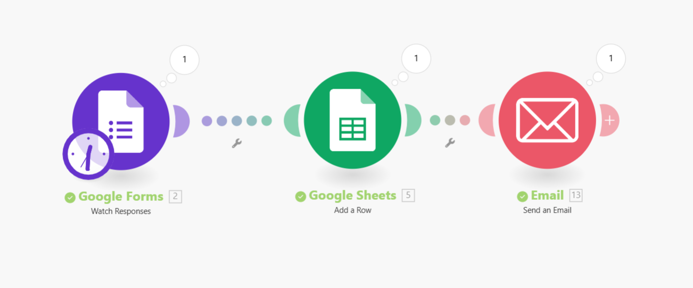

# 📦 KCC Orders Tracking – Make (Integromat) Scenario

This repository contains an automation scenario built using **Make (formerly Integromat)** to streamline the process of tracking orders.

---

## 🚀 Project Overview
The automation connects three main services:

1. **Google Forms** – Collects order details from customers.  
2. **Google Sheets** – Stores form responses in a structured table for easy tracking.  
3. **Email** – Sends confirmation or notification emails automatically.  

This workflow ensures that every order submission is saved and acknowledged without manual effort.

---

## 📂 Repository Structure

├── KCC Orders Tracking.xlsx # Sample Google Sheets file for storing responses

├── Scenario.blueprint.json # Exported Make Scenario (Blueprint)

├── Scenario.png # Workflow diagram / screenshot of the scenario

├── README.md # Documentation

---

## ⚙️ How to Use

1. **Import the Scenario**  
   - Go to [Make](https://www.make.com/).  
   - Create a new Scenario.  
   - Click the menu (⋮) → *Import Blueprint*.  
   - Upload the provided `Scenario.blueprint.json`.  

2. **Configure Connections**  
   - Connect your **Google Forms**.  
   - Link to your **Google Sheets** file (`KCC Orders Tracking.xlsx`).  
   - Set up your **Email** (Gmail or SMTP).  

3. **Run the Scenario**  
   - Turn on the scenario.  
   - Submit a response in Google Forms.  
   - Check Google Sheets for a new row.  
   - Verify that the confirmation email is sent.

---

## 📸 Workflow Preview

---

## 📊 Example Google Sheet
A sample Excel file `KCC Orders Tracking.xlsx` is included to show how responses are structured. You can import it into Google Sheets for quick setup.

---

## 🔒 Notes
- Make sure you have the necessary permissions for Google services.  
- Keep your credentials safe; **do not share API keys or sensitive data in public repos**.  

---

## 📧 Contact
If you have any issues or suggestions, feel free to open an issue or contribute!  

